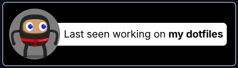

# GitHub Status Component
A (very WIP) web component for displaying the user's most recent GitHub activity.

The end goal is to include a robust set of activity string generation tooling using the GitHub API, allowing for a plethora of unique status messages with links to relevant data (while unavailable in the current mockup PNG, the `my dotfiles` string will contain a link to the given repository).

## To-Do List
- [ ] Determine a method for generating equivalent SVGs for usage in Markdown documents
- [ ] Write shadow DOM injection implmentation (i.e. generic web component code)
- [ ] Finish string generation logic
- [ ] Polish HTML/CSS and inline within client component
- [ ] Parameterize component and document said parameters
- [ ] Write CLI tooling to provide API information for usage with Actions pipeline
- [ ] Write generic Actions pipeline for use with CLI tool

## Using the GitHub API
It relies on the `/users/<username>/events/public` endpoint for activity information. It is recommended to have an independent runner supplying this resource at a static location with a less intensive update regimen, as the GitHub API is limited to [60 requests per hour for unauthenticated users](https://docs.github.com/en/rest/using-the-rest-api/rate-limits-for-the-rest-api?apiVersion=2022-11-28#primary-rate-limit-for-unauthenticated-users). A typical set of requests to provision all info needed will use 2-5 requests on average (one for events, 1-4 for `PushEvent` commit info), meaning that in the unlikely event where a user were to visit your site more than 20-30 times, the info would become unfetchable for them. 

In the final implementation, a set of utilites will be provided for provisioning this info to mimic the API URL structure, using GitHub actions with user content links as the baseline implementation. On top of this provisioning toolset, utilities will be provided for filtering unwanted events, preventing them from being displayed.
